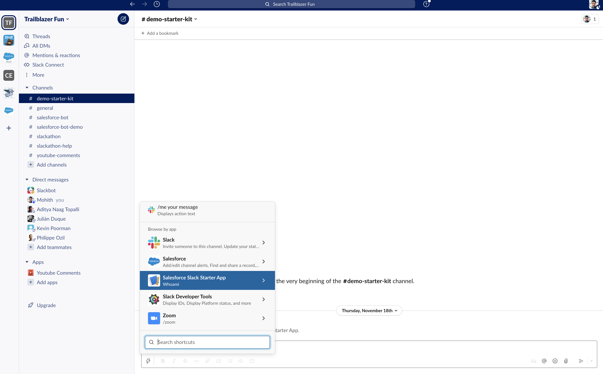
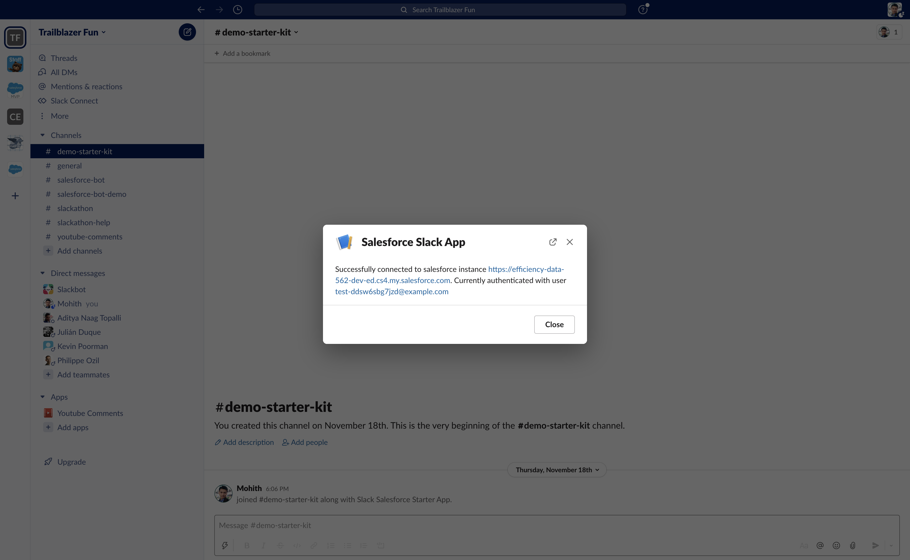

# Salesforce Slack Starter Kit

🚧 This project is under development currently 🚧

The project provides an opinionated minimum scaffold for developers wanting to build Slack Apps using [Bolt SDK](https://api.slack.com/tools/bolt) (Node.js version) and have requirements to integrate the Slack App to Salesforce data.

The app follows monorepo approach and has a Slack App implemented using Bolt SDK (Node.js) and corresponding Salesforce metadata in one repo. The scaffold provides configuration files to host and run the app on Heroku.

Setting up of the Salesforce and Heroku Instance is automated to cut down number of manual configurations required to set up development environments.

## Installation

## Prerequisites

You will need the following to deploy this sample app.

- `git` (download [here](https://git-scm.com/downloads))
- `node` >= 14 (download [here](https://nodejs.org/en/download/))
- Salesforce Dev Hub
  - If you don't have one, [sign up](https://developer.salesforce.com/signup) for a Developer Edition org and then follow the [instructions](https://help.salesforce.com/articleView?id=sfdx_setup_enable_devhub.htm&type=5) to enable Dev Hub.
- `sfdx` CLI >= sfdx-cli/7.129.0 (download [here](https://developer.salesforce.com/tools/sfdxcli))
- Heroku account ([signup](https://signup.heroku.com))
- `heroku` CLI (download [here](https://devcenter.heroku.com/articles/heroku-cli))

## App Deploy and Set up

### Configuring Slack App

1. Open [https://api.slack.com/apps/new](https://api.slack.com/apps/new) and choose "From an app manifest"
2. Choose the workspace you want to install the application to
3. Copy the contents of [manifest.yml](./apps/slack-salesforce-starter-app/manifest.YAML) into the text box that says `*Paste your manifest code here*` and click _Next_
4. Review the configuration and click _Create_
5. Now click _Install to Workspace_ and _Allow_ on the screen that follows. You'll be redirected to the App Configuration dashboard.

### Script to Set up Salesforce Org and Heroku Environment with code and config

The [`scripts/deploy.js`](./scripts/deploy.js) file is what automates all the deploys and
integrates them with various configuration values.

You can choose between using:

1. [OAuth 2.0 JWT Bearer Flow for Server-to-Server Integration](https://help.salesforce.com/s/articleView?id=sf.remoteaccess_oauth_jwt_flow.htm&type=5). You will need to specify a dev hub, and the script will create a scratch org for you, in which the needed connected app and certificates will be automatically created.
1. [Username Password Flow (SOAP API)](https://developer.salesforce.com/docs/atlas.en-us.api.meta/api/sforce_api_calls_login.htm). You will need to specify your org's username, password and login URL. No connected app is created.

Note that the later should only be used for testing purposes as it's considered insecure.

The script automates the steps below:

- Creation of scratch org for Salesforce development (if using JWT bearer flow).
- Creation, Deployment and set up of Heroku instance. The environment variables are automatically configured to connect to Salesforce.
- Setup and deploy Connected Apps for authorization between Salesforce and Slack App hosted on Heroku (if using JWT bearer flow).

Follow the following instructions to set up your development environment:

```console
$ sfdx auth:web:login -d -a DevHub  # Authenticate using your Dev Hub org credentials (only needed if using JWT bearer flow)
$ heroku login  # Login with your Heroku account (or create one)
$ git clone https://github.com/developerforce/salesforce-slack-starter-kit
$ cd salesforce-slack-starter-kit/scripts
$ npm install
$ cd ..
$ node scripts/deploy.js
```

#### Setting Heroku environment variables for Slack

1. During the set up process, the script will prompt you to enter value for `SLACK_BOT_TOKEN`. To enter this value open your apps configuration page from [this list](https://api.slack.com/apps), click _OAuth & Permissions_ in the left hand menu, then copy the value in _Bot User OAuth Token_ and paste into terminal.

2. The script will prompt you for slack signing secret `SLACK_SIGNING_SECRET`. To enter this value open your apps configuration page from [this list](https://api.slack.com/apps), click _Basic Information_ and scroll to the section _App Credentials_ and click show button and copy the _Signing Secret_ and paste into terminal.

### Set Heroku Instance in your Slack App

This is the last step, you will need to enter the corrent Heroku Instance url in Slack App.

- To enter this value open your apps configuration page from [this list](https://api.slack.com/apps), click _App Manifest_. Find the `request_url` in the manifest and modify it to replace `heroku-app` with your actual heroku domain name. Note at the end of this step your url should look like `https://<heroku-domain>.herokuapp.com/slack/events`

### Directory Structure

```bash
├── force-app             # Folder that holds Salesforce metadata types
├── scripts
|   ├── deploy            # Scripts to automate scratch org creation, heroku environment
│   ├── deploy.js         # Automated Deploy script launch file
│   └── templates         # Template for Connected apps setup
├── apps
     ├── slack-salesforce-starter-app # Node.js Slack app
        ├── config              # Configs for Slack app
        ├── app.js              # Main file for Slack app launch
        ├── salesforcelib       # Folder for Salesforce related code
              ├── connect.js       # Module to establish Salesforce connection
        ├── manifest.YAML       # Slack app manifest file
        ├── Procfile            # Heroku Procfile for deployment
```

## How to Build and Deploy Code

- For Salesforce metadata synchronization use `sfdx force:source:pull` to retrieve and `sfdx force:source:push` to deploy metadata from orgs to local project folder `force-app`

- For Node.js app for Slack using Bolt SDK, cd into `apps/slack-salesforce-starter-app`, add git remote to app repo using `heroku git:remote -a <heroku app name>` and run `git push heroku main` to push code to Heroku

## How to Test the Salesforce Connection

To test the app, make sure to run the Global Shortcut command `Whoami` that ships with the app as shown in the below screenshot



Successful connection output



Note: the command can fail the first time you execute it because the heroku app may be sleeping.

## Considerations for Production app

- For production application change the `SF_LOGIN_URL` from 'https://test.salesforce.com' to `https://login.salesforce.com`

- Generate private key and certificates using open SSL as documented in the Salesforce (docs)[https://developer.salesforce.com/docs/atlas.en-us.sfdx_dev.meta/sfdx_dev/sfdx_dev_auth_key_and_cert.htm] and change environment variables in Heroku to use new private key and consumer key for connected apps

- Heroku Free Dynos sleep if left ideal and hence use other Dyno types.

## Troubleshooting

- Connected apps activation takes couple minutes, so in case the app is failing, wait for 2 minutes and give a retry.
- If the app is failing, Heroku logs can help provide the exact line failing

## Further Reference

- [Bolt Family of SDKs](https://api.slack.com/tools/bolt)
- [Block Builder](https://www.npmjs.com/package/slack-block-builder)
