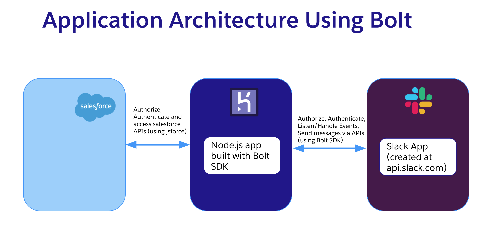
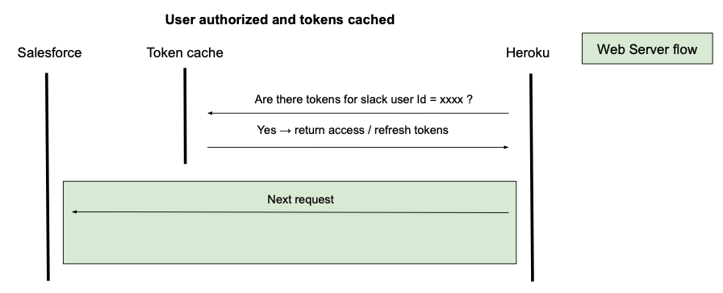
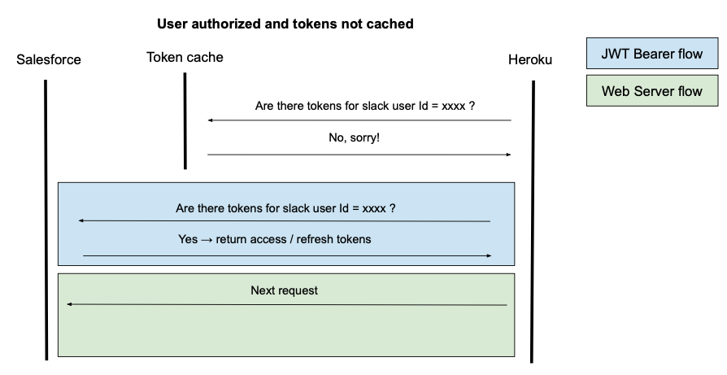
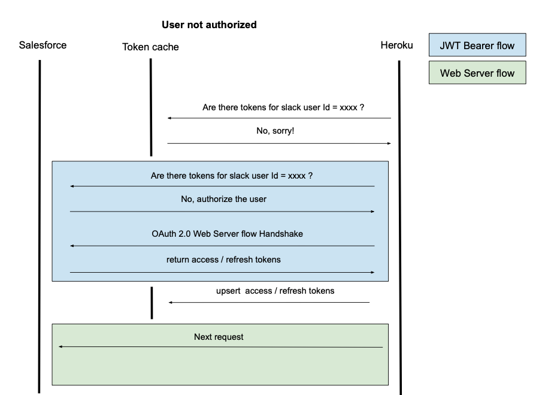
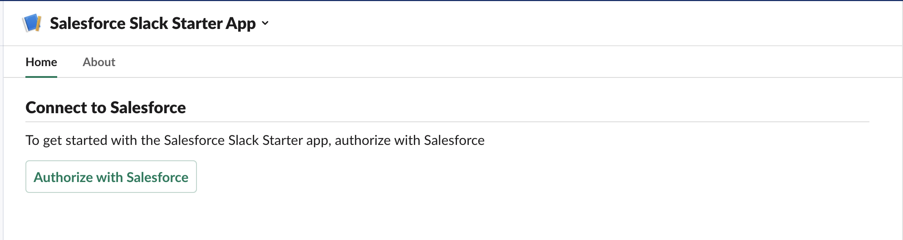

# Salesforce Slack Starter Kit

Before looking into this project, we recommend you look into [Salesforce Slack SDK](https://developer.salesforce.com/blogs/2021/09/introducing-foyer-native-slack-integration-for-the-salesforce-platform) (currently in pilot for ISVs). Be sure to check back Salesforce [developer blog](https://developer.salesforce.com/blogs) regularly for announcements on future milestones of Salesforce Slack SDK. If you want to become part of the pilot, contact your technical account manager.

If you decide to build a custom Slack App integrated with Salesforce from scratch, this project can help you get started.

## Current Limitation

Multiple salesforce org connections to a single Slack workspace are not supported. Note that Salesforce Slack SDK plans to support this feature.

## About the Project

This project helps you to create an opinionated minimum scaffold for building a Slack Apps that integrates Salesforce data using [Bolt SDK](https://api.slack.com/tools/bolt) (Node.js version) and [jsforce](https://jsforce.github.io/).

The scaffolded app follows the monorepo approach. It contains a Slack App implemented using Bolt SDK (Node.js) and it also setups the needed Salesforce data and metadata for managing users and authentication. The scaffold provides configuration files to host and run the app on Heroku.

Most of Salesforce and Heroku setup tasks are automated to cut down a number of manual configurations required to set up development environments.

We also configure environment variables required for local development, debugging, and testing.

The project assumes you want to run the Slack App in the Salesforce user context.

If you want to use a single Salesforce user (Integration user) for performing all data operations in Salesforce from Slack, check out [Salesforce Slack Starter Kit (Server to Server Integration)](https://github.com/developerforce/salesforce-slack-starter-kit-s2s).

## App Architecture

### System Architecture

The image below shows the systems involved in the application.



Heroku acts as middleware and hosts the Node.js app that connects to Slack APIs (through Slack Bolt) and Salesforce APIs (through jsforce). To get familiar with the app's system architecture, you can watch this short [video](https://www.youtube.com/watch?v=x0i7UNuMTAM) and familiarize yourself with the app's system architecture.

We use Heroku environment variables to securely manage necessary configuration variables related (such as clientId, consumer key and signing secret) to Slack and Salesforce connection.

### Heroku App <-> Salesforce

The app uses jsforce and the [OAuth 2.0 Web Server Flow for Web App Integration
](https://help.salesforce.com/s/articleView?id=sf.remoteaccess_oauth_web_server_flow.htm&type=5) flow to connect to Salesforce.

Once the user successfully authorizes Slack workspace to Salesforce, we persist the access and refresh tokens. This allows the app to perform subsequent requests to Salesforce as an authorized user.

We store the tokens securely in a Salesforce custom object called Slack_Authentication\_\_c:

```
Slack_Authentication__c
├── Access_Token\_\_c
├── Refresh_Token\_\_c
├── Slack_User_ID\_\_c
├── User\_\_c
```

On each request, the app needs to query this object to find if the user has already authorized. Although in reality, it first tries to retrieve this info from a cache that we've implemented to improve performance. As at this stage we don't know if the user is authorized yet, we need to use the [OAuth 2.0 JWT Bearer Flow for Server-to-Server Integration](https://help.salesforce.com/s/articleView?id=sf.remoteaccess_oauth_jwt_flow.htm&type=5) flow to perform this first step.

Once authorized, the app uses the stored access and refresh tokens to perform requests to Salesforce in the context of the authorized user.

These are the three possible scenarios for the authorization process:







### Heroku App <-> Slack

The Heroku App connects to Slack using Bolt.js.

## Prerequisites

To be able to run this project you will need:

- `git` (download [here](https://git-scm.com/downloads))
- `node` >= 14 (download [here](https://nodejs.org/en/download/))
- Salesforce Org
  - If you don't have one, [sign up](https://developer.salesforce.com/signup) for a free Developer Edition org.
  - If you want to use scratch orgs follow the [instructions](https://help.salesforce.com/articleView?id=sfdx_setup_enable_devhub.htm&type=5) to enable Dev Hub in your Salesforce Developer Org.
- `sfdx` CLI >= sfdx-cli/7.129.0 (download [here](https://developer.salesforce.com/tools/sfdxcli))
- Heroku account ([signup](https://signup.heroku.com))
- `heroku` CLI (download [here](https://devcenter.heroku.com/articles/heroku-cli))

## Setup Steps

### Configuring Slack app at api.slack.com

1. Open [https://api.slack.com/apps/new](https://api.slack.com/apps/new) and choose **From an app manifest**
2. Choose the workspace you want to install the application to
3. Copy the contents of [manifest.yml](./apps/salesforce-slack-app/manifest.YAML) into the text box that says **Paste your manifest code here** and click _Next_
4. Review the configuration and click _Create_
5. Now click _Install App_ on the left menu. Then click the _Install to Workspace_ button and then click on _Allow_

### Deploying the app using a Salesforce Non-scratch org and Heroku

1. Authenticate to your Salesforce org and set as default:

```
sfdx auth:web:login --setdefaultusername -a mydevorg
```

2. Login to your Heroku Account

```
heroku login
```

3. Clone the salesforce-slack-starter-kit repository

```
git clone https://github.com/developerforce/salesforce-slack-starter-kit
```

4. Run Deployment Script

```
cd salesforce-slack-starter-kit/scripts
npm install
cd ..
node scripts/deploy.js
```

5. Choose **Non-Scratch Org** when the script prompts you to select Salesforce environment

6. The script prompts you to enter value for `SLACK_BOT_TOKEN`. To enter this value open your apps configuration page from [this list](https://api.slack.com/apps), click _OAuth & Permissions_ in the left hand menu, then copy the value in _Bot User OAuth Token_ and paste into terminal.

7. The script prompts you for slack signing secret `SLACK_SIGNING_SECRET`. To enter this value open your apps configuration page from [this list](https://api.slack.com/apps), click _Basic Information_ and scroll to the section _App Credentials_ and click show button and copy the _Signing Secret_ and paste into terminal.

### Deploying the app using a Salesforce scratch org and Heroku

1. Authenticate to your Salesforce org that has DevHub enabled

```
sfdx auth:web:login --setdefaultdevhubusername -a DevHub
```

2. Login to your Heroku Account

```
heroku login
```

3. Clone the salesforce-slack-starter-kit repository

```
git clone https://github.com/developerforce/salesforce-slack-starter-kit
```

4. Run Deployment Script

```
cd salesforce-slack-starter-kit/scripts
npm install
cd ..
node scripts/deploy.js
```

5. Choose **Scratch Org** when the script prompts you to select Salesforce environment

6. The script prompts you to enter value for `SLACK_BOT_TOKEN`. To enter this value open your apps configuration page from [this list](https://api.slack.com/apps), click _OAuth & Permissions_ in the left hand menu, then copy the value in _Bot User OAuth Token_ and paste into terminal.

7. The script prompts you for slack signing secret `SLACK_SIGNING_SECRET`. To enter this value open your apps configuration page from [this list](https://api.slack.com/apps), click _Basic Information_ and scroll to the section _App Credentials_ and click show button and copy the _Signing Secret_ and paste into terminal.

### Configuring Heroku Domain URL in Slack app Manifest

1. To configure Heroku domain open your apps configuration page from [this list](https://api.slack.com/apps), click _App Manifest_.

2. Find the `request_url` fields in the manifest and modify it to replace `heroku-app` with your actual heroku domain name.

   **At the end of this step your `request_url` should look like `https://<heroku-domain>.herokuapp.com/slack/events`**

## Deployment Script Actions

The [`scripts/deploy.js`](./scripts/deploy.js) automates deployment of Slack app built using Bolt SDK (Node.js version) and Salesforce App.

The high-level overview of actions performed by the deployment script is listed below.

1. **Salesforce Org Setup**

The script prompts you to Select the Salesforce Development Environment type. The script creates a scratch org using the provided dev hub if you choose a scratch org-based development. The script then deploys the source code and the associated metadata and assigns the necessary permission set to the user.

2. **Generation of certificate needed for JWT Bearer flow OAuth flow**

We generate a private key and digital certificate to set up the JWT Bearer flow for authentication.

3. **Salesforce ConnectedApp deployment**

Both the JWT Bearer and the Web Server flows need a connected app to be deployed to Salesforce. We use the same connected app for both flows. In the case of JWT bearer flow, a consumer key and a digital certificate is needed. In the case of Web Server flow, a consumer key, consumer secret and a callback URL are needed. All these configuration values are autogenerated and setup in the connected app, that we deploy to Salesforce.

4. **Heroku Bolt Node.js app creation and deployment**

Finally, we create a Heroku app, setup all the needed configuration variables and deploy the Bolt Node.js app.

We also write the configuration variables to a .env file for local development

## Directory Structure

```bash
├── force-app             # Folder that holds Salesforce metadata types
├── scripts
|   ├── deploy            # Scripts to automate scratch org creation, heroku
|   |                     #environment
│   ├── deploy.js         # Automated Deploy script launch file
│   └── templates         # Template for Connected apps setup
├── apps
     ├── salesforce-slack-app # Node.js Slack app
        ├── config              # Configs for Slack app
        |── listeners           # Modules to listen event for actions,
        |                       # shotcuts and view events in Slack
        |── middleware          # Middleware for Salesforce
        |                       # Authentication using OAuth 2.0 Web based flow
        |── routes              # Route for OAuth callback
        |
        ├── app.js              # Main file for Slack app launch
        ├── user-interface      # User Interface folder for Home page
        |                       # Modals and Messages in Block Kit format
        |
        ├── salesforce          # Folder for Salesforce integration related code
              ├── server-server-auth.js # Module to establish Salesforce connection using JWT
              ├── user-user-auth.js # Module to establish Salesforce connection using Web based OAuth 2.0
        ├── manifest.YAML       # Slack app manifest file
        ├── Procfile            # Heroku Procfile for deployment
```

## How to Build and Deploy Code

### Building Salesforce app using a Scratch Org

- For Salesforce metadata synchronization in scratch orgs use `sfdx force:source:pull` to retrieve and `sfdx force:source:push` to deploy metadata from orgs to local project folder `force-app`

### Building Salesforce App Using Non-Scratch Org

- For Salesforce metadata synchronization in developer orgs use `sfdx force:source:retrieve -p force-app/main/default` to retrieve and `sfdx force:source:deploy -p force-app/main/default` to deploy metadata from orgs to local project folder `force-app`

### Building and deploying Bolt Node.js app

- For the Bolt Node.js app use the steps below:
  - cd into apps/slack-salesforce-starter-ap folder `cd apps/salesforce-slack-app`
  - add git remote to app repo using `heroku git:remote -a <heroku app name>`
  - run `git push heroku main` to push code to Heroku

## Local Development

1. To use ngrok, first install it downloading the executable or with npm:

```console
$ npm install ngrok -g
```

2. Next you’ll have to [sign up](https://dashboard.ngrok.com/get-started/setup) for a free ngrok account.
3. Once logged in, navigate to “Setup & Installation“ and copy your auth token.
4. Then set your auth token in your local machine:

```console
$ ngrok authtoken my_auth_token
```

5. Run the ngrok tunnel as follows:

```console
$ ngrok http 3000
```

6. Copy the ngrok tunnel URL to the following places:

- Your manifest file request URLs
- The HEROKU_URL environment variable in your .env file
- The Callback URL for the connected app that’s used for authorization in Salesforce - simply add the ngrok URL in a new line

7. Now you are prepared to run the app locally! In another terminal different from the one in which you’re running ngrok, execute `node app.js` from the project folder. You can then make changes to the code and restart the app as many times as you want.

## How to Test the Salesforce Connection

1. Authenticate to Salesforce by navigating to app home and clicking on `Authorize with Salesforce` button.

You will need the password of your scratch org. You can generate one using `sfdx force:user:password:generate --targetusername scratchorg`



2. Once successfully authorized, run the Global Shortcut command `Whoami` that ships with the app as shown in the below screenshot


3. Successful connection output is similar to screenshot below


Note: the command can fail the first time you execute it if you are using Free Tier of heroku app as dynos sleep if left ideal. Restart the app to resume.

## Considerations for Production app

- For a production application change the `SF_LOGIN_URL` from 'https://test.salesforce.com' to `https://login.salesforce.com`

- Generate the private key and certificates using open SSL as documented in the Salesforce (docs)[https://developer.salesforce.com/docs/atlas.en-us.sfdx_dev.meta/sfdx_dev/sfdx_dev_auth_key_and_cert.htm] and change environment variables in Heroku to use new `private key`, `consumer key` and `client secret` obtained from the connected app in Salesforce.

- Heroku Free Dynos sleeps if left idle. For Production application we recommend you look into [other types](https://www.heroku.com/dynos) of Dynos.

## Troubleshooting

- Connected apps activation takes couple minutes. In case the app fails with a 400 error for JWT auth, wait for 2 minutes and give a retry.
- If the app is failing, tail Heroku logs to see any errors

## Further Reference

- [Bolt Family of SDKs](https://api.slack.com/tools/bolt)
- [Block Builder](https://www.npmjs.com/package/slack-block-builder)
